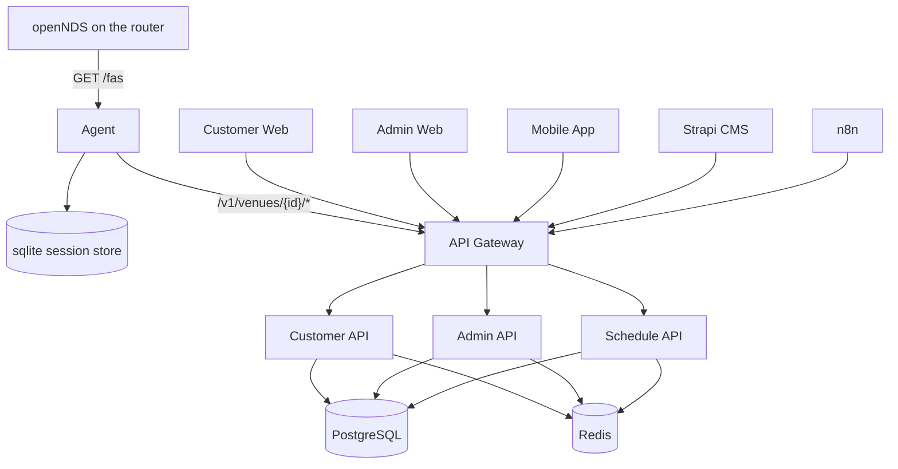

# Ru5ty Gate

<p align="left">
  
</p>

Captive portal platform. A Rust agent runs on the venue router behind [openNDS](https://opennds.readthedocs.io/) as its Forwarding Authentication Service, and a central platform (Rust APIs, web dashboards and a mobile app) sits behind it.

The repository is a monorepo: a Rust (Axum) workspace for the backend and shared crates, with TypeScript frontends, a mobile app, a CMS and workflow automation alongside.

<p align="left">


</p>

## Architecture



The agent is the only component that runs on the router. It keeps working through central-platform outages by persisting sessions locally and buffering session events for later sync. The central platform endpoints the agent calls are listed in [common/central-client/README.md](common/central-client/README.md); they are not implemented by the backend services yet.

## Structure

```
ru5ty-gate/
├── Cargo.toml                      # Rust workspace
├── apps/
│   ├── automation/n8n/             # Workflow automation
│   ├── backend/
│   │   ├── agent/                  # Captive portal agent (router daemon, FAS server)
│   │   ├── admin-api/              # Administrative backend service
│   │   ├── api-gateway/            # API gateway and routing layer
│   │   ├── customer-api/           # Customer-facing API service
│   │   └── schedule-api/           # Scheduled jobs and webhook delivery
│   ├── cms/                        # Headless CMS (Strapi)
│   ├── frontend/
│   │   ├── admin-web/              # Admin dashboard (React + Vite)
│   │   └── customer-web/           # Customer web app (Next.js)
│   └── mobile/customer-mobile/     # Mobile app (React Native / Expo)
├── common/                         # Shared Rust crates
│   ├── agent-config/               # Agent TOML settings
│   ├── central-client/             # HTTP client for the central platform API
│   ├── fas-server/                 # openNDS FAS HTTP server
│   ├── heartbeat/                  # Heartbeat and event sync tasks
│   ├── session-store/              # sqlite session store and sync queue
│   ├── auth/ cache/ config/ database/ email/ export/ http/ logging/
│   └── metrics/ observability/ queue/ sms/ storage/ types/ utilities/ webhooks/
├── devops/                         # Dev Docker Compose, k8s manifests, scripts
├── infrastructure/                 # Nginx and Terraform
└── documentation/                  # Project documentation
```

## Quick start: the agent

```bash
cp apps/backend/agent/config/agent.example.toml apps/backend/agent/config/agent.toml
pnpm dev:agent
```

Or without pnpm:

```bash
cargo run -p ru5ty-gate-agent -- --config apps/backend/agent/config/agent.toml
```

The agent listens on `127.0.0.1:4009` in development and keeps its session database under `apps/backend/agent/data/`. See [apps/backend/agent/README.md](apps/backend/agent/README.md) for the protocol, configuration and openNDS setup.

## Quick start: the rest of the platform

[documentation/monorepo-guide.md](documentation/monorepo-guide.md) covers prerequisites, Postgres and Redis, environment files, migrations, the backend services, the frontends and the mobile app.

## Development ports

Every app uses a fixed port in the 4000 range in local development:

| App | Port |
|---|---|
| api-gateway | 4000 |
| admin-api | 4001 |
| customer-api | 4002 |
| schedule-api | 4003 |
| admin-web | 4004 |
| customer-web | 4005 |
| cms | 4006 |
| customer-mobile | 4007 |
| n8n | 4008 |
| agent | 4009 |

## Quality gates

| Gate | Command |
|---|---|
| typecheck | `pnpm typecheck` (`cargo check --workspace --all-targets` and `tsc --noEmit`) |
| lint | `pnpm lint` (`cargo clippy --workspace --all-targets -- -D warnings` and ESLint) |
| format | `pnpm format:check` (`cargo fmt --all --check` and Prettier) |

Agent crates only:

```bash
cargo test -p ru5ty-gate-agent-config -p ru5ty-gate-session-store -p ru5ty-gate-central-client \
  -p ru5ty-gate-heartbeat -p ru5ty-gate-fas-server -p ru5ty-gate-agent
```

The Postgres-backed services use `#[sqlx::test]` and need `DATABASE_URL`; see [documentation/monorepo-guide.md](documentation/monorepo-guide.md).

## Documentation

See [documentation/README.md](documentation/README.md) for the index. Conventions for contributors and for Claude Code live in [CLAUDE.md](CLAUDE.md) and `.claude/`.

## License

Proprietary. Copyright (c) 2025-2026 Zynkosi Tech (Pty) Ltd. See [LICENSE](LICENSE). Workspace crates declare `LicenseRef-Zynkosi-Proprietary` and are not published.
