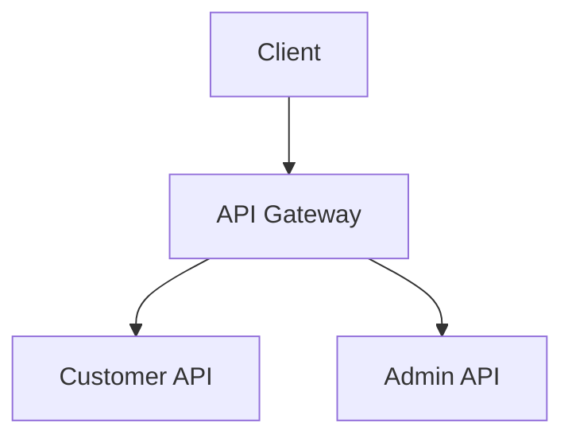
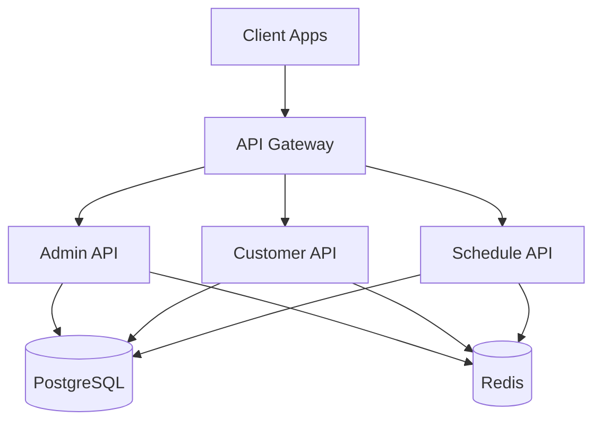
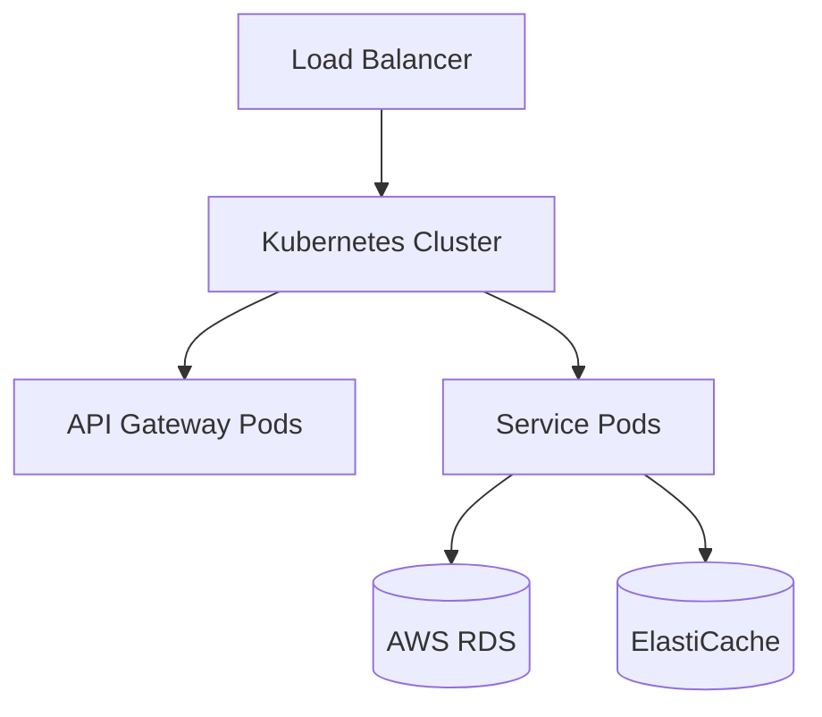

# Documentation

Central documentation hub for Ru5ty Gate.

## Overview

This directory contains comprehensive documentation for the entire monorepo, including architecture decisions, API documentation, deployment guides, and development workflows.

## Index

### Getting started

- [Monorepo guide](./monorepo-guide.md) - Prerequisites, Postgres and Redis, environment files, running every app, testing and deployment
- [Captive portal agent](../apps/backend/agent/README.md) - FAS protocol, configuration, running on a router
- [Security and feature review](./security-and-feature-review.md) - Open security findings and missing features, written as a work queue

### Architecture and conventions

- [Repository layer](./repository-layer.md) - Shared data-access layer in `common/database`
- [Common package environment config](./common-package-env-config.md) - How shared crates read configuration
- [Webhooks](./webhooks.md) - Outbound webhooks and delivery
- [File upload](./file-upload.md) - File upload handling
- [Sentry wiring](./sentry-wiring.md) - Error reporting setup
- [Rust migration](./rust-migration/plan.md) - Migration plan and wire contract

### Deployment

- [CI/CD pipeline](./deployment/cicd.md) - Continuous integration and deployment

## Documentation Standards

### Writing Documentation

1. **Markdown Format**: Use Markdown for all documentation
2. **Clear Structure**: Use headings, lists, and code blocks
3. **Code Examples**: Include practical code examples
4. **Keep Updated**: Update docs when making code changes
5. **Screenshots**: Use screenshots for UI-related docs

### Code Examples

Always include language identifiers in code blocks:

```typescript
// Good
const example = 'This has a language identifier';
```

### Diagrams

Use Mermaid for diagrams:



## API Documentation

API documentation is auto-generated using OpenAPI/Swagger specifications. Access the interactive API docs:

- **Development**: `http://localhost:3000/docs`
- **Staging**: `https://staging-api.example.com/docs`
- **Production**: `https://api.example.com/docs`

## Architecture Diagrams

### System Overview



### Deployment Architecture



## Contributing to Documentation

1. Create a new branch for documentation changes
2. Add or update documentation files
3. Ensure all links work correctly
4. Submit a pull request with clear description
5. Request review from team members

## Documentation Checklist

When creating new features, ensure you document:

- [ ] API endpoints (request/response formats)
- [ ] Environment variables
- [ ] Configuration options
- [ ] Usage examples
- [ ] Error scenarios
- [ ] Testing instructions
- [ ] Deployment considerations

## Tools

### Documentation Generation

- **rustdoc** (`cargo doc --workspace --no-deps`): Rust API reference for the backend crates
- **OpenAPI**: planned for the Rust services, see `.claude/instructions/openapi.instructions.md`
- **Mermaid**: Diagram creation
- **Markdown**: Standard documentation format

### Viewing Documentation

```bash
# Rust API reference
cargo doc --workspace --no-deps --open
```

## Resources

- [Markdown Guide](https://www.markdownguide.org/)
- [Mermaid Documentation](https://mermaid.js.org/)
- [OpenAPI Specification](https://swagger.io/specification/)
- [TypeDoc Documentation](https://typedoc.org/)

## Maintainers

Documentation is maintained by the development team. For questions or suggestions, please open an issue or contact the team.

## License

Documentation is part of the project and follows the same license terms.
